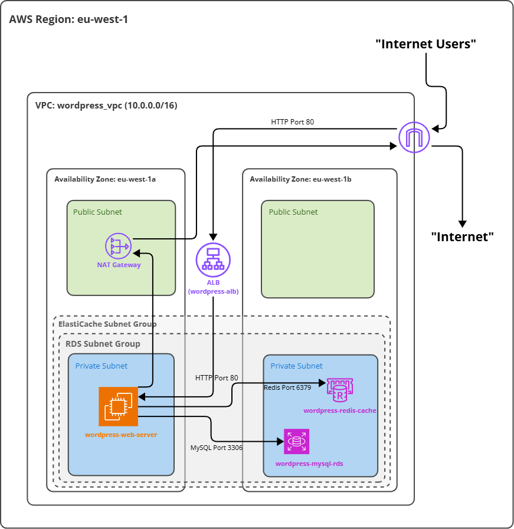

# WordPress Deployment on AWS using Terraform and Bash

## Overview

This project demonstrates the deployment of a highly available and scalable WordPress website on AWS using Infrastructure as Code (Terraform) and an automated deployment script (Bash). The infrastructure includes a custom VPC, public and private subnets, an Application Load Balancer (ALB) for traffic distribution, an EC2 instance hosting WordPress, an RDS MySQL database for data persistence, and an ElastiCache Redis cluster for object caching, enhancing performance. All stateful components (EC2, RDS, Redis) are placed in private subnets for security.

## Architecture Diagram


## Prerequisites

Before you begin, ensure you have the following installed and configured:

*   **AWS CLI:** Configured with AWS credentials that have sufficient permissions to create the resources defined in the Terraform code. ([Installation Guide](https://docs.aws.amazon.com/cli/latest/userguide/getting-started-install.html))
*   **Terraform:** Version 1.2.0 or later recommended. ([Installation Guide](https://learn.hashicorp.com/tutorials/terraform/install-cli))
*   **Git:** For cloning the repository. ([Installation Guide](https://git-scm.com/book/en/v2/Getting-Started-Installing-Git))
*   **AWS Session Manager Plugin:** For connecting to the private EC2 instance via the AWS CLI. ([Installation Guide](https://docs.aws.amazon.com/systems-manager/latest/userguide/session-manager-working-with-install-plugin.html))

## Infrastructure Details

The Terraform configuration (`*.tf` files) provisions the following AWS resources in the `eu-west-1` region by default:

*   **Networking:**
    *   Custom VPC with CIDR `10.0.0.0/16`.
    *   Public Subnets across 2+ AZs for the ALB and NAT Gateway.
    *   Private Subnets across 2+ AZs for EC2, RDS, and ElastiCache instances.
    *   Internet Gateway (IGW) attached to the VPC for public subnet internet access.
    *   NAT Gateway deployed in one public subnet with an Elastic IP for outbound internet access from private subnets.
    *   Public and Private Route Tables managing traffic flow.
*   **Compute & Load Balancing:**
    *   Application Load Balancer (ALB): Publicly accessible, distributes HTTP traffic to the EC2 instance. Placed in public subnets.
    *   EC2 Instance: Runs Amazon Linux 2, hosts Apache webserver, PHP, and WordPress. Placed in a private subnet. Uses an IAM Role (`ec2-ssm-role`) enabling SSM access.
*   **Database & Caching:**
    *   RDS MySQL Instance: Managed database instance (e.g., `db.t3.micro`) running in private subnets. Configured via a DB Subnet Group.
    *   ElastiCache Redis Cluster: Managed Redis instance (e.g., `cache.t2.micro`) for object caching, running in private subnets. Configured via an ElastiCache Subnet Group.
*   **Security:**
    *   Security Groups (least-privilege access):
        *   `alb_sg`: Allows inbound HTTP (port 80) from the internet (`0.0.0.0/0`). Allows all outbound.
        *   `ec2_sg`: Allows inbound HTTP (port 80) *only* from the `alb_sg`. Allows inbound SSH (port 22) from `0.0.0.0/0` (consider restricting this further in production). Allows all outbound traffic (for updates, connecting to AWS services, RDS, Redis).
        *   `rds_sg`: Allows inbound MySQL (port 3306) *only* from the `ec2_sg`.
        *   `redis_sg`: Allows inbound Redis (port 6379) *only* from the `ec2_sg`.

## Configuration

### Terraform (`terraform.tfvars`)

*   Sensitive values and environment-specific parameters should be defined in a `terraform.tfvars` file in the project root.
*   **IMPORTANT:** This file (`terraform.tfvars`) should **NOT** be committed to Git. Add it to your `.gitignore` file.
*   **Required Variables:**
    *   `ec2_key_name`: Name of an existing EC2 Key Pair in the target region for SSH access.
    *   `db_username`: Username for the RDS MySQL database.
    *   `db_password`: Password for the RDS MySQL database (mark as `sensitive = true` in `variables.tf`).
    *   `wp_admin_user`: Desired initial admin username for the WordPress installation (used by the deployment script).
    *   `wp_admin_password`: Desired initial admin password for the WordPress installation (mark as `sensitive = true` in `variables.tf`, used by deployment script).
    *   `wp_admin_email`: Desired initial admin email for the WordPress installation (used by deployment script).
*   Other variables (like region, instance types, CIDRs) have defaults defined in `variables.tf` but can be overridden in `terraform.tfvars`.

*Example `terraform.tfvars` (DO NOT COMMIT):*
```terraform
# terraform.tfvars
ec2_key_name      = "your-eu-west-1-keypair"
db_username       = "wordpressuser"
db_password       = "A_VERY_s3cur3_DB_P@ssw0rd!"
wp_admin_user     = "mywpadmin"
wp_admin_password = "A_COMPLEX_WP_P@ssw0rd!"
wp_admin_email    = "admin@example.com"
```

### Deployment Script (deploy_wordpress.sh)
*  This script automates WordPress installation and configuration on the EC2 instance after the infrastructure is created.
*  It requires specific environment variables to be set within the EC2 instance's shell session (via SSM) before execution.
*  **Required Environment Variables (Set during SSM session):**
   *  `DB_NAME`: Database name (e.g., wordpressdb, must match Terraform config or default).
   *  `DB_USER`: Database username (from terraform.tfvars).
   *  `DB_PASSWORD`: Database password (from terraform.tfvars).
   *  `DB_HOST`: RDS instance endpoint (from terraform output -raw rds_endpoint).
   *  `WP_ADMIN_USER`: WordPress admin username (from terraform.tfvars).
   *  `WP_ADMIN_PASSWORD`: WordPress admin password (from terraform.tfvars).
   *  `WP_ADMIN_EMAIL`: WordPress admin email (from terraform.tfvars).
   *  `WP_URL`: Public URL for WordPress (http://<ALB_DNS_NAME>, get ALB DNS from terraform output -raw alb_dns_name).
   *  `REDIS_HOST`: ElastiCache Redis endpoint (from terraform output -raw redis_endpoint).
   *  `REDIS_PORT`: ElastiCache Redis port (from terraform output -raw redis_port).
 

## Deployment Steps

1.  **Clone Repository:** Clone this repository to your local machine.
    ```bash
    git clone https://github.com/VyvaHart/wordpress-aws-deployment.git
    cd wordpress-aws-deployment
    ```
2.  **Prepare Terraform Variables:** Create a `terraform.tfvars` file in the project root. Populate it with your specific values for required variables like `ec2_key_name`, `db_username`, `db_password`, `wp_admin_user`, `wp_admin_password`, and `wp_admin_email` (see Configuration section above). Ensure this file is listed in your `.gitignore`.
    *Example `terraform.tfvars` entry:*
    ```terraform
    ec2_key_name = "key-pair-name"
    db_password  = "DB_PASSWORD"
    # ... other variables
    ```
3.  **Initialize Terraform:** Download the necessary provider plugins.
    ```bash
    terraform init
    ```
4.  **Plan Infrastructure:** Review the AWS resources Terraform will create, change, or destroy.
    ```bash
    terraform plan -var-file="terraform.tfvars"
    ```
5.  **Apply Infrastructure:** Create the AWS resources defined in the configuration. This step can take 10-15 minutes (primarily waiting for the RDS instance).
    ```bash
    terraform apply -var-file="terraform.tfvars" -auto-approve
    ```
6.  **Get Outputs:** After successful application, retrieve the necessary endpoints and DNS names from Terraform's output. Run this command locally in your project directory:
    ```bash
    terraform output
    ```
    Note down the values for `alb_dns_name`, `rds_endpoint`, `redis_endpoint`, and `redis_port`.
7.  **Get EC2 Instance ID:** Identify the EC2 instance created by Terraform. You can find this in the AWS Management Console (EC2 -> Instances -> Look for `wordpress-web-server`) or by adding an output to `outputs.tf`:
    ```terraform
    # Add to outputs.tf
    output "ec2_instance_id" {
      description = "ID of the EC2 instance"
      value       = aws_instance.web-server.id
    }
    ```
    Then run `terraform output -raw ec2_instance_id` locally. Let's name this `<your-instance-id>`.
8.  **Connect to EC2 via SSM:** Start a secure shell session to the private EC2 instance using AWS Systems Manager Session Manager. Ensure you have the SSM Plugin installed for the AWS CLI.
    ```bash
    aws ssm start-session --target <your-instance-id> --region eu-west-1
    ```
    You should have a shell prompt (`sh-4.2$`) running on the EC2 instance.
9.  **Set Environment Variables (Inside SSM Session):** Export the necessary environment variables that the `deploy_wordpress.sh` script requires. Use the values from your `terraform.tfvars` file and the outputs gathered in step 6.
    ```bash
    # Example commands inside the SSM session (replace placeholders):
    export DB_NAME="wordpressdb"
    export DB_USER="<db_username_from_tfvars>"
    export DB_PASSWORD='<db_password_from_tfvars>'
    export DB_HOST="<paste_rds_endpoint_output_here>"
    export WP_ADMIN_USER="<wp_admin_user_from_tfvars>"
    export WP_ADMIN_PASSWORD='<wp_admin_password_from_tfvars>'
    export WP_ADMIN_EMAIL="<wp_admin_email_from_tfvars>"
    export WP_URL="http://<paste_alb_dns_name_output_here>"
    export REDIS_HOST="<paste_redis_endpoint_output_here>"
    export REDIS_PORT="<paste_redis_port_output_here>"

    # Verify a variable (optional): echo $WP_URL
    ```
10. **Transfer Deployment Script (Inside SSM Session):** Copy the content of your local `deploy_wordpress.sh` script to the EC2 instance. You can use `vim` or the `cat << 'EOF'` method (i use `vim`):
    ```bash
    # Example using cat (paste your entire script between the EOF lines):
    cat > /home/ssm-user/deploy_wordpress.sh << 'EOF'
    #!/bin/bash
    set -e # Exit script if any command fails

    # Required Environment Variables (should be set before running)
    # ... (ALL YOUR SCRIPT CONTENT) ...

    echo "--- WordPress Deployment Complete ---"
    echo "Access URL: $WP_URL"
    echo "Admin User: $WP_ADMIN_USER"
    EOF
    ```
11. **Make Script Executable (Inside SSM Session):** Grant execute permissions to the script.
    ```bash
    chmod +x /home/ssm-user/deploy_wordpress.sh
    ```
12. **Run Deployment Script (Inside SSM Session):** Execute the script to install and configure WordPress.
    ```bash
    /home/ssm-user/deploy_wordpress.sh
    ```
    Monitor the output in your terminal for success messages or any errors. The script should indicate when it's complete.
13. **Verify Deployment:**
    *   Open a web browser on your local machine.
    *   Navigate to the WordPress site using the ALB DNS name (the value you set for `WP_URL`, e.g., `http://<alb_dns_name>`). The default WordPress homepage should load.
    *   Navigate to the admin login page (`/wp-admin` appended to the URL).
    *   Log in using the `WP_ADMIN_USER` and `WP_ADMIN_PASSWORD` you configured. Successful login confirms the database connection and installation worked.
14. **Exit SSM Session:** Type `exit` in the SSM terminal session and press Enter to return to your local machine's prompt.

## Troubleshooting

*   **Connection Timeouts (Browser/DB/Redis):**
    *   **Check Security Groups:** Ensure the rules correctly allow traffic between the necessary components. Verify:
        *   `alb_sg`: Inbound HTTP (80) from `0.0.0.0/0`.
        *   `ec2_sg`: Inbound HTTP (80) from `alb_sg`'s ID. Outbound All `0.0.0.0/0`.
        *   `rds_sg`: Inbound MySQL (3306) from `ec2_sg`'s ID.
        *   `redis_sg`: Inbound Redis (6379) from `ec2_sg`'s ID.
        *   Double-check that the correct Security Group IDs are referenced in the rules.
    *   **Check Subnet Associations:** Confirm instances/services (EC2, RDS, ElastiCache) are launched in the intended private subnets and that those subnets are associated with the correct DB/ElastiCache Subnet Groups.
    *   **Check Routing:** Ensure the private subnet route table has a default route (`0.0.0.0/0`) pointing to the NAT Gateway ID. Ensure the public subnet route table has a default route pointing to the Internet Gateway ID.
    *   **Check Service Status:** In the AWS Console, verify that the RDS instance and ElastiCache cluster are in the 'Available' state. They can take several minutes to become fully ready after creation.
*   **Deployment Script Errors (`deploy_wordpress.sh`):**
    *   **Environment Variables:** The most common issue. Connect via SSM again and use `echo $<VARIABLE_NAME>` (e.g., `echo $DB_HOST`) to verify *all* required environment variables were exported correctly *before* you ran the script. Pay attention to typos and ensure passwords with special characters were enclosed in single quotes during `export`.
    *   **Permissions:** Verify the script has execute permissions (`ls -l /home/ssm-user/deploy_wordpress.sh`).
    *   **Command Errors:** Review the script's console output during execution for specific errors from `yum` (package installation), `wp-cli` (WordPress commands), `sed` (file editing), `chown`/`chmod` (permissions).
    *   **Logs:** Check system and application logs on the EC2 instance (connect via SSM):
        *   Apache/HTTPD errors: `sudo tail -n 50 /var/log/httpd/error_log`
        *   General system messages: `sudo tail -n 50 /var/log/messages`
    *   **WP-CLI Check:** Ensure WP-CLI is correctly installed and in the path: `wp --info`.
    *   **Network Connectivity (from EC2):** Can the EC2 instance reach the database and Redis endpoints? Try `telnet <rds_endpoint> 3306` and `telnet <redis_endpoint> 6379` from the EC2 instance (you might need to install telnet: `sudo yum install -y telnet`). A "Connected" message is good; "Connection timed out" or "Connection refused" indicates a network/SG issue. Can it reach the internet for downloads? Try `ping google.com` or `curl -I https://wordpress.org`.
*   **SSM Connection Failure:**
    *   **IAM Role/Policy:** Verify the EC2 instance (`wordpress-web-server`) has the `ec2-ssm-role` attached in the AWS Console (EC2 -> Instances -> Select Instance -> Security tab). Check that this role has the `AmazonSSMManagedInstanceCore` AWS managed policy attached (IAM -> Roles -> `ec2-ssm-role`).
    *   **SSM Agent:** Connect via EC2 Instance Connect or SSH (if key/SG allows) and check the agent status: `sudo systemctl status amazon-ssm-agent`. Restart if needed: `sudo systemctl restart amazon-ssm-agent`.
    *   **Network Path:** Ensure the EC2 instance (in its private subnet) has network connectivity to the AWS SSM service endpoints. This requires a route through the NAT Gateway (check private route table points `0.0.0.0/0` to NAT GW ID).
*   **WordPress Issues (Post-Install):**
    *   **Permissions:** Check file/directory ownership and permissions within `/var/www/html` using `ls -l /var/www/html` inside an SSM session. The owner:group should generally be `apache:apache`. Directories typically `775` or `755`, files `664` or `644` (except `wp-config.php` which should be `600`). The script attempts to set these correctly.
    *   **WP Debugging:** To see specific PHP errors causing white screens or malfunctions, temporarily enable WP_DEBUG. Connect via SSM, edit `/var/www/html/wp-config.php` (`sudo vim /var/www/html/wp-config.php`), find the line `define( 'WP_DEBUG', false );` and change it to `define( 'WP_DEBUG', true );`. Save the file. Reload the problematic WordPress page in your browser to see detailed error messages. **Important:** Remember to change it back to `false` after troubleshooting!
    *   **Redis Cache Plugin:** If you suspect Redis caching issues, log in to WP Admin -> Settings -> Redis. Check the status. You might need to click "Enable Object Cache" again if the `object-cache.php` drop-in didn't copy correctly (though the script runs `wp redis enable`). Ensure the `WP_REDIS_HOST` and `WP_REDIS_PORT` defines in `wp-config.php` are correct.

## Cleanup

To remove **all** AWS resources created by this Terraform configuration and avoid incurring further costs, follow these steps:

1.  Navigate to the project directory (containing your `.tf` files) in your local terminal.
2.  Ensure you have the `terraform.tfvars` file present (or provide variables via command line if needed by `destroy`).
3.  Run the Terraform destroy command. This will list all resources to be destroyed and ask for confirmation unless `-auto-approve` is used.
    ```bash
    terraform destroy -var-file="terraform.tfvars"
    ```
    *Type `yes` when prompted to confirm.*
    *Alternatively, to skip the confirmation prompt:*
    ```bash
    terraform destroy -var-file="terraform.tfvars" -auto-approve
    ```
4.  Monitor the output. Destruction can also take several minutes (~5min), especially for RDS and associated backups/ENIs. Ensure it completes without errors. If errors occur (e.g., dependency violations), you might need to manually delete some resources in the AWS console and run `destroy` again.
